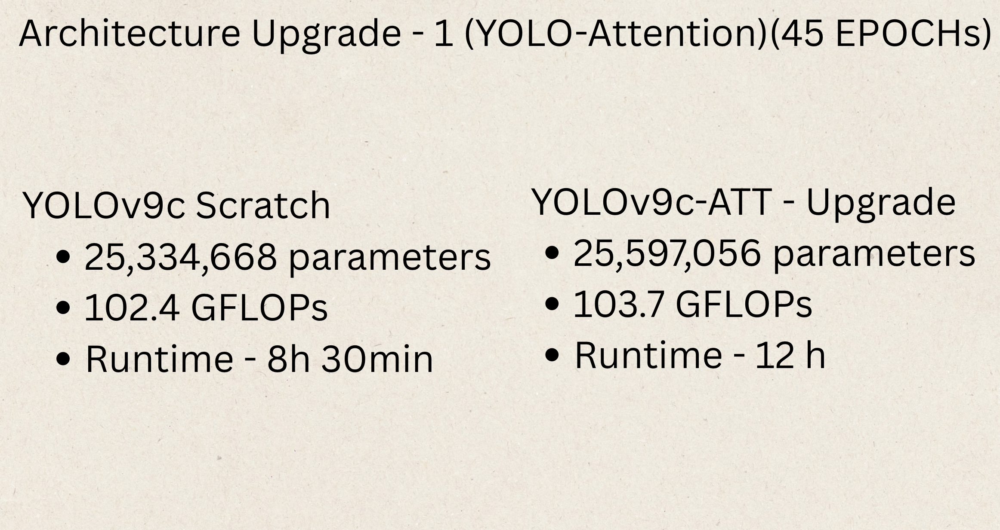
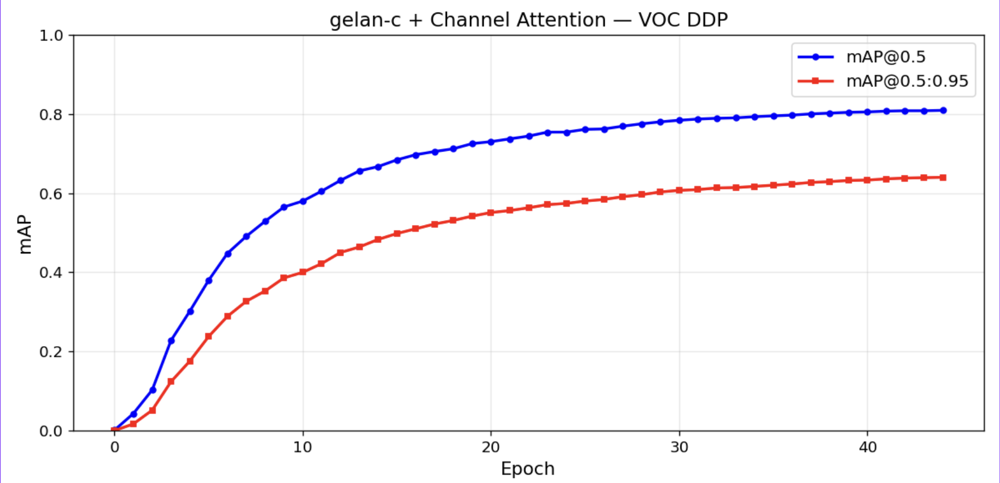
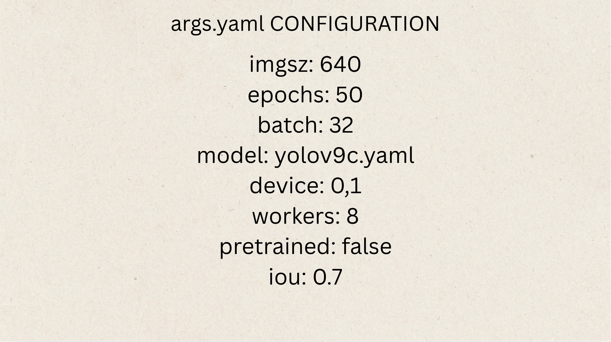
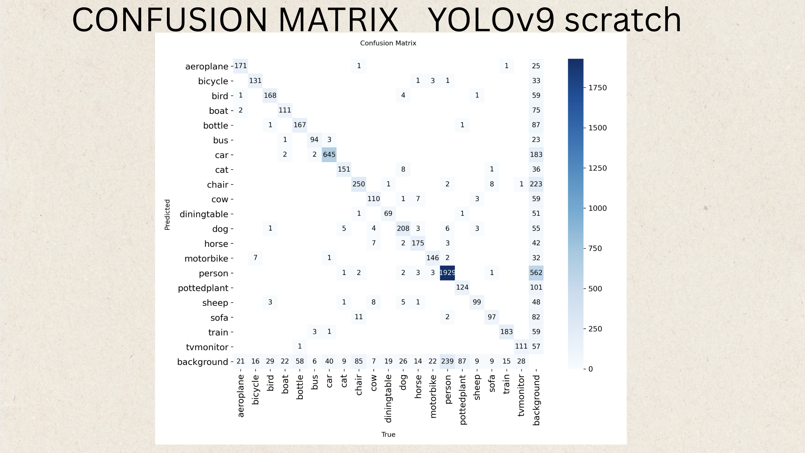
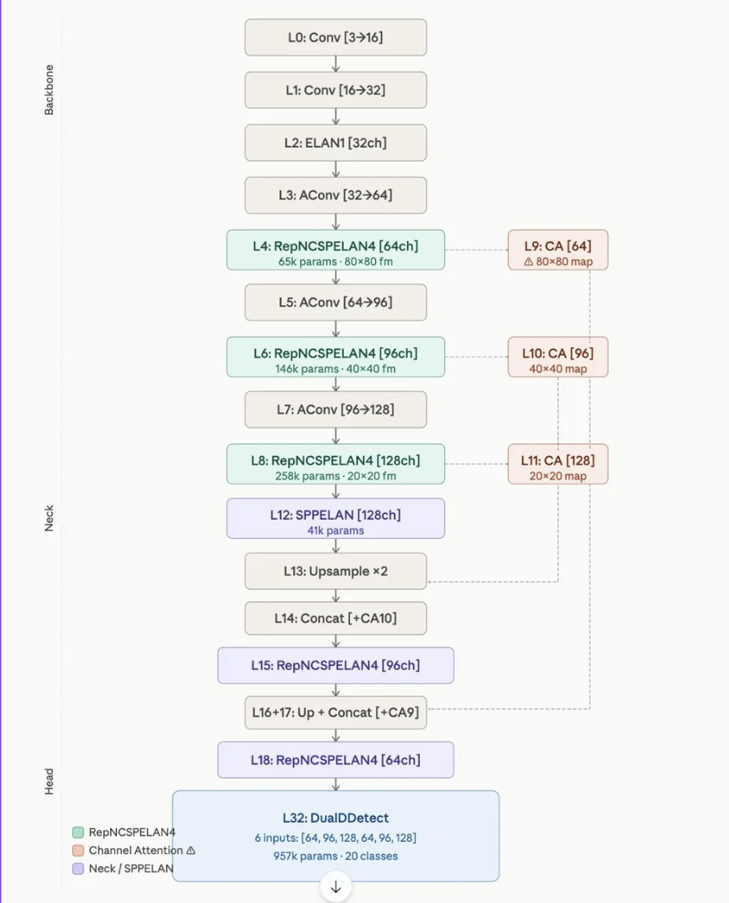
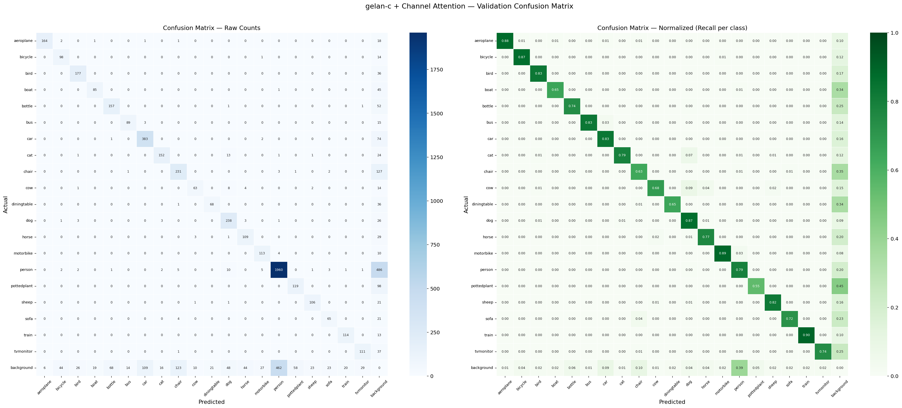
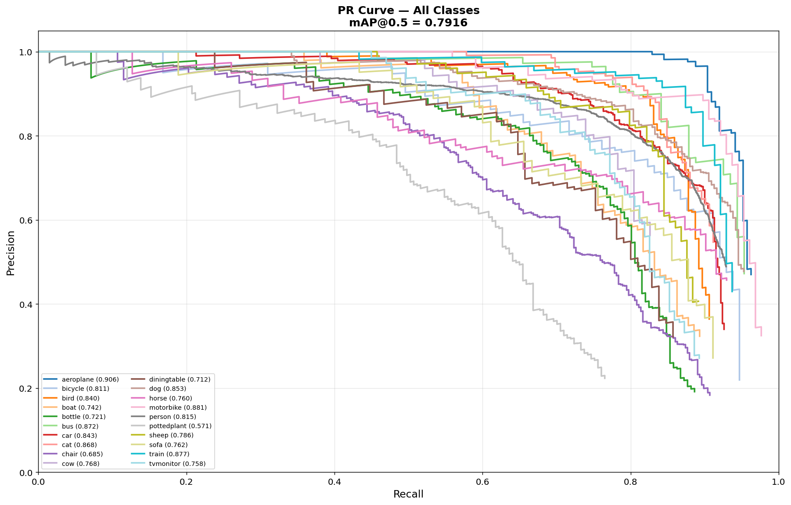

# Channel Attention on YOLO-v9

A Kaggle-style project for converting Pascal VOC annotations into YOLO format and preparing data for training YOLO-v9 with channel attention improvements.

## Project Overview

This repository contains the notebook used to:

- Download Pascal VOC 2007 and 2012 datasets
- Convert VOC XML annotations into YOLO `.txt` label files
- Create YOLO dataset configuration files
- Clone and install YOLO-v9 dependencies
- Prepare the dataset for model training and visualization

## Repository Contents

- `channel-attention-on-yolo-v9.ipynb` - Main notebook with the full data preparation and YOLO-v9 setup workflow
- `README.md` - Project documentation
- `screenshots/` - Result images and visualizations
  - `screenshots/YOLO v9.mp4` - Side-by-side prediction video showing YOLOv9 and YOLOv9 with channel attention
- `.git/` - Git repository metadata

## Key Steps

1. Download Pascal VOC 2007 and 2012 archives
2. Extract VOC dataset files
3. Convert VOC annotations to YOLO format
4. Save class names and dataset YAML configuration
5. Verify generated YOLO label files
6. Clone YOLO-v9 repository and install required packages
7. Optionally visualize label bounding boxes on example images

## How to Use

1. Open `channel-attention-on-yolo-v9.ipynb` in Jupyter, VS Code, or Kaggle Notebook.
2. Run the notebook cells in order.
3. Confirm that YOLO label files are created under `yolo_labels/VOC2007` and `yolo_labels/VOC2012`.
4. Use the generated `data.yaml` to train YOLO-v9 on the prepared dataset.

## Expected Output

- YOLO label files with normalized coordinates, one `.txt` annotation file per image
- `classes.txt` containing the 20 Pascal VOC class names
- `data.yaml` with paths to training and validation images
- Visualized image examples showing bounding boxes over detected objects

## Results and Visualizations

### Model Performance

The trained YOLO-v9 model with channel attention has been evaluated and visualized through the following metrics:

- **Confusion Matrix** — Shows the classification performance across all 20 Pascal VOC classes
- **Precision-Recall Curve** — Demonstrates the trade-off between precision and recall for object detection
- **Detection Samples** — Real-world inference examples showcasing the model's detection capabilities

### Results Media

#### Data Preparation Visualization

_Overview of the data preparation pipeline: Pascal VOC dataset conversion, label generation, and YOLO format normalization._

#### Detection Results

_Example detection result showing the model identifying multiple object classes in a single image._

_Inference sample demonstrating vehicle detection with high confidence scores._

_Multi-class detection example with both person and object detections._

_Complex scene with multiple overlapping objects, demonstrating the model's handling of crowded environments._

#### Model Evaluation Metrics

_Confusion matrix displaying per-class accuracy and misclassifications across all 20 Pascal VOC classes._

_Precision-Recall curve illustrating the model's performance across different confidence thresholds._

#### Video Comparison

[**YOLO v9.mp4**](screenshots/YOLO%20v9.mp4) — Side-by-side comparison video showing predictions from standard YOLOv9 and YOLOv9 with channel attention improvements, highlighting the performance benefits of the channel attention mechanism.

## Notes

- This project demonstrates the integration of channel attention mechanisms into YOLO-v9 for improved object detection performance on the Pascal VOC dataset.
- All screenshots and results are generated during the notebook execution and stored in the `screenshots/` directory.
- The comparison video can be viewed directly in GitHub's media player.
